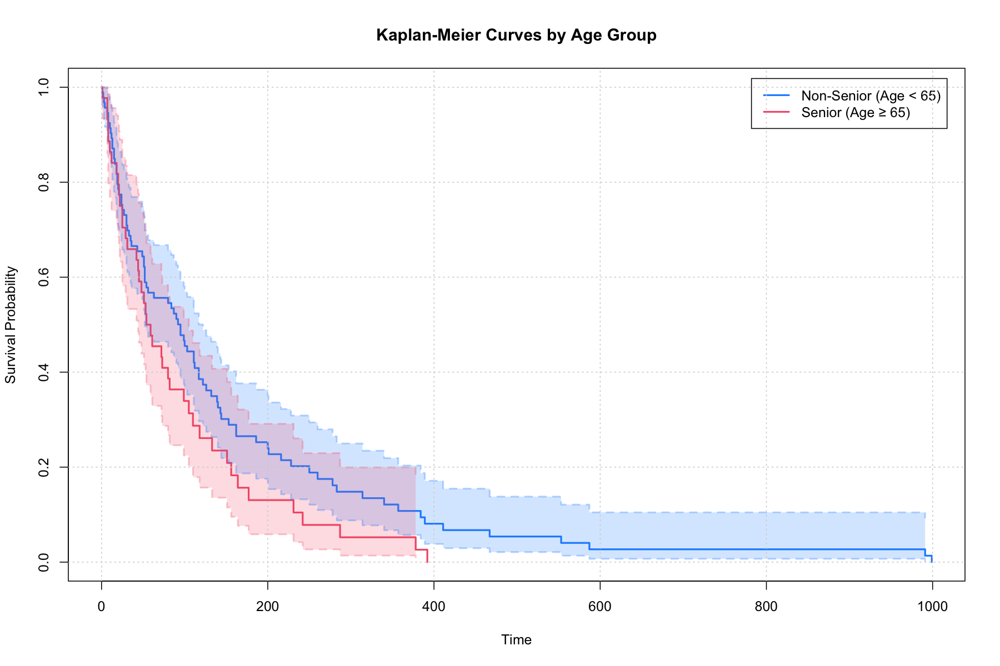
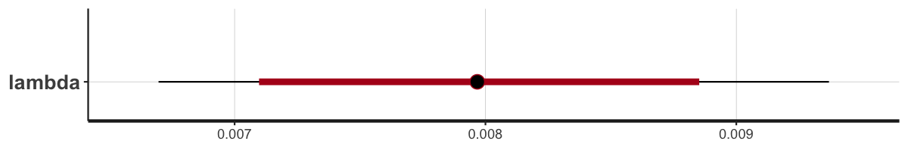

# Bayesian Survival Analysis with Stan

## Overview
This repository introduces Bayesian Survival Analysis using R and Stan. While frequentist survival analysis is well-documented, Bayesian methods, especially those implemented with Stan, are less commonly covered. This project addresses that gap by demonstrating exploratory analysis with standard packages and datasets, including Kaplan-Meier curves, followed by Bayesian implementations of parametric survival models such as Weibull and Exponential, as well as semi-parametric Cox proportional hazards models using Stan.

The project utilizes a very common dataset `veteran` from the `survival` package in R, which contains data on lung cancer patients. The dataset includes variables such as treatment type (chemotheory vs standard), age, cell type, and survival time, etc. For more details, refer to the documentation of the `survival` package.

 

## Kaplan-Meier Survival Curves
Kaplan-Meier survival curves visualize survival probabilities over time. The curves can also compare survival between different groups, such as treatment types. Using the veteran dataset, three Kaplan-Meier curves are plotted: overall survival, survival by treatment type (chemotherapy vs standard), and survival by age group (senior vs non-senior, with the threshold at age 65). These plots are generated using the `Surv` object and `survfit` function from the `survival` packages in R, and the code can be found in [02_plot_km_curve.R](code/02_plot_km_curve.R).

    
    
    

 

## Exponential Model

### The Model
Exponential survival models are the most basic parametric survival models that assume a constant hazard rate over time. The survival function and the hazard function are defined, respectively, as $S(t) = exp(-\lambda t)$ and $h(t) = \lambda$, where $\lambda$ is the rate parameter.

In [04_fit_exponential.stan](code/04_fit_exponential.stan), the observed survival times are modeled using an exponential distribution,

$$t_{obs} \sim Exponential(\lambda),$$

with prior

$$ \lambda \sim LogNormal(0, 1). $$

 

The Stan user guide provides tips on how to code the likelihood function for an exponential model. However, it uses a common censoring time for all cencored individuals, which is usually not the case. A modified version is followed and can be found in my Stan code [04_fit_exponential.stan](code/04_fit_exponential.stan).

Instead of a single cencoring time, $t_{cen}$, we need different cencoring times for different individuals, denoted as $t_{cen, \space j}$, $j = 1, 2, ..., N_{cen}$. For the observed event times, we keep the same notation, $t_{obs, \space i}$, $i = 1, 2, ..., N_{obs}$. The likelihood is then specified as 

$$ \space p(\space t_{obs}, t_{cen}, N_{obs}, N_{cen} \space | \space \lambda) = \prod_{i=1}^{N_{obs}} exp(t_{obs, \space i} | \lambda) \space \prod_{j=1}^{N_{cen}} (1 - F_{T}(t_{cen, \space j} | \lambda)) ,$$

where $F_{T}(t_{cen} | \lambda)$ is the cumulative distribution function (CDF) of the exponential distribution evaluated at the censored times.

Taking logarithm of the likelihood, we have:

$$ \space log \space p(\space t_{obs, \space i}, t_{cen, \space j}, N_{obs}, N_{cen} \space | \space \lambda) = \sum_{i=1}^{N_{obs}} log \space [\space exp(t_{obs, \space i} | \lambda) \space] + \sum_{j=1}^{N_{cen}} log \space [ \space 1 - F_{T}(t_{cen, \space j} | \lambda) \space]. $$

which belongs to the model block in the Stan script.

### The Estimates
The model produces a posterior sample for the $\lambda$ parameter, with a mean $0.008$ and a $95\%$ credible interval between $0.007$ and $0.009$.

    

    

Using this sample of the $\lambda$ parameter, we can also plot the posterior distribution of event time and a posterior survival curve:

    
    

### Exponential Model with Covariates
From the [Kaplan-Meier Survival Curves](#kaplan-meier-survival-curves) section, we can tell that senior and non-senior patients have distinct survival probabilities. Here we estimate the respective survival curve for each of the age group by linking the covariate *senior* (see the beginning part of the R code [02_plot_km_curve.R](02_plot_km_curve.R)) to the rate parameter:

$$ \lambda = exp( \mu  + X \cdot \beta ),$$

where $\mu$ and $\beta$ have priors

$$\mu \sim Normal(0, \space 2)$$
$$\beta \sim Normal(0, \space 2)$$

 
This applies to both the observed and cencored covariate. Thus,

$$t_{obs} \sim Exponential(\space exp( \mu  + X_{obs} \cdot \beta ) \space),$$

and the cumulative distribution function in the likelihood

$$F_{T} = (\space t_{cen} \space | \space exp( \mu  + X_{cen} \cdot \beta ) \space).$$

### The Estimates of Age Effect
The estimates of the parameter $\mu$ and $\beta$ are shown in the below table and bar plot.

    

    

From these estimates, we can obtain the posterior distributions of event time and posterior survival curves for both the non-senior and senior age group accordingly:

    
    

