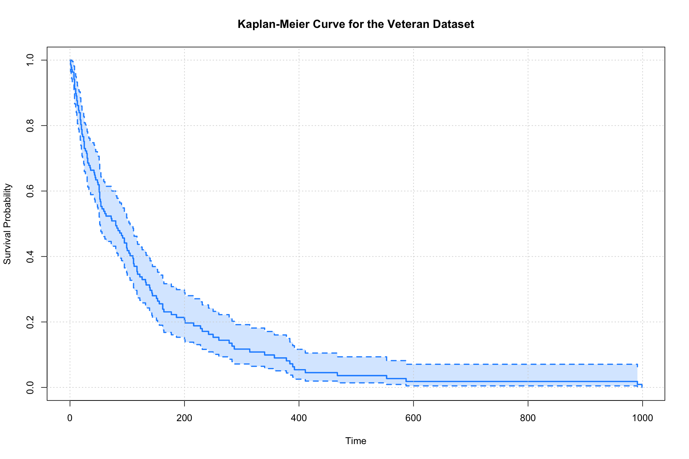
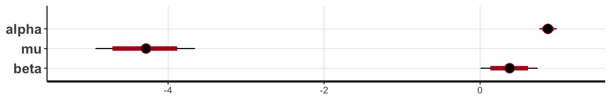
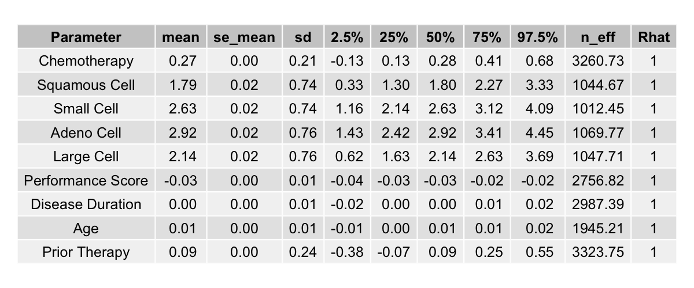

# Bayesian Survival Analysis with Stan

## Overview
This repository introduces Bayesian Survival Analysis using R and Stan. While frequentist survival analysis is well-documented, Bayesian methods, especially those implemented with Stan, are less commonly covered. This project addresses that gap by demonstrating exploratory analysis with standard packages and datasets, including [Kaplan-Meier curves](#kaplan-meier-survival-curves), followed by Bayesian implementations of parametric survival models such as [Exponential](#exponential-model) and [Weibull](#weibull-model), as well as semi-parametric [Cox proportional hazards models](#cox-proportional-hazard-model) using Stan.

The project utilizes a very common dataset `veteran` from the `survival` package in R, which contains data on lung cancer patients. The dataset includes variables such as treatment type (chemotheory vs standard), age, cell type, and survival time, etc. For more details, refer to the documentation of the `survival` package.

 

## Kaplan-Meier Survival Curves
Kaplan-Meier survival curves visualize survival probabilities over time. The curves can also compare survival between different groups, such as treatment types. Using the veteran dataset, three Kaplan-Meier curves are plotted: overall survival, survival by treatment type (chemotherapy vs standard), and survival by age group (senior vs non-senior, with the threshold at age 65). These plots are generated using the `Surv` object and `survfit` function from the `survival` packages in R, and the code can be found in [02_plot_km_curve.R](code/02_plot_km_curve.R).

    
    
    

 

## Exponential Model

### The Model
Exponential survival models are the most basic parametric survival models that assume a constant hazard rate over time. The survival function and the hazard function are defined, respectively, as $S(t) = exp(-\lambda t)$ and $h(t) = \lambda$, where $\lambda$ is the rate parameter.

In [e02_fit_exponential.stan](code/e02_fit_exponential.stan), the observed survival time is modeled using an exponential distribution,

$$t_{obs} \sim Exponential(\lambda),$$

with prior

$$ \lambda \sim LogNormal(0, 1). $$

 

The Stan user guide provides tips on how to code the likelihood function for an exponential model. However, it uses a common censoring time for all cencored individuals, which is usually not the case. A modified version is followed and can be found in my Stan code [e02_fit_exponential.stan](code/e02_fit_exponential.stan).

Instead of a single cencoring time, $t_{cen}$, we need different cencoring times for different individuals, denoted as $t_{cen, \space j}$, $j = 1, 2, ..., N_{cen}$. For the observed event times, we keep the same notation, $t_{obs, \space i}$, $i = 1, 2, ..., N_{obs}$. The likelihood is then specified as 

$$ \space p(\space t_{obs}, t_{cen}, N_{obs}, N_{cen} \mid \lambda) = \prod_{i=1}^{N_{obs}} exp(t_{obs, \space i} \mid \lambda) \space \prod_{j=1}^{N_{cen}} (1 - F_{T}(t_{cen, \space j} \mid \lambda)) ,$$

where $F_{T}(t_{cen} \mid \lambda)$ is the cumulative distribution function (CDF) of the exponential distribution evaluated at the censored times.

Taking logarithm of the likelihood, we have:

$$ \space log \space p(\space t_{obs, \space i}, t_{cen, \space j}, N_{obs}, N_{cen} \mid \lambda) = \sum_{i=1}^{N_{obs}} log \space [\space exp(t_{obs, \space i} \mid \lambda) \space] + \sum_{j=1}^{N_{cen}} log \space [ \space 1 - F_{T}(t_{cen, \space j} \mid \lambda) \space]. $$

which belongs to the model block in the Stan script.

 

### The Estimates
The model produces a posterior sample for the $\lambda$ parameter, with a mean $0.008$ and a $95 \%$ credible interval between $0.007$ and $0.009$.

    

    

Using this sample of the $\lambda$ parameter, we can also plot the posterior distribution of event time and a posterior survival curve:

    
    

 

### Exponential Model with Covariates
From the [Kaplan-Meier Survival Curves](#kaplan-meier-survival-curves) section, we can tell that senior and non-senior patients have distinct survival probabilities. Here we estimate the respective survival curve for each of the age group by linking the covariate *senior* (see the beginning part of the R code [02_plot_km_curve.R](02_plot_km_curve.R)) to the rate parameter:

$$ \lambda = exp( \mu  + X \cdot \beta ),$$

where $\mu$ and $\beta$ have priors

$$\mu \sim Normal(0, \space 2),$$
$$\beta \sim Normal(0, \space 2).$$

 
This applies to both the observed and cencored covariate. Thus,

$$t_{obs} \sim Exponential(\space exp( \mu  + X_{obs} \cdot \beta ) \space),$$

and the cumulative distribution function in the likelihood

$$F_{T} = (\space t_{cen} \mid exp( \mu  + X_{cen} \cdot \beta ) \space).$$

This part of modeling is implemented in [e05_fit_exponential_covariates.stan](./code/e05_fit_exponential_covariates.stan).

 

### The Estimates of Age Effect
The estimates of the parameter $\mu$ and $\beta$ are shown in the below table and bar plot.

    

    

From these estimates, we can obtain the posterior distributions of event time and posterior survival curves for both the non-senior and senior age group accordingly:

    
    

 

## Weibull Model

### The Model
The Weibull model is in fact a more general form of the exponential model. It has a hazard function $h(t) = \lambda \alpha t^{\alpha - 1}$ and a survival function $S(t) = exp(-\lambda t^{\alpha})$, in which the shape parameter $\alpha$ can take any positive value, capturing a varying hazard (increasing, decreasing, or being constant) over time. When $\alpha = 1$, the hazard and survival functions reduce to their exponential counterpart introduced in the [Exponential Model](#exponential-model) section.

Due to this flexibility, in our `veteran` case, the Weibull model fits the data better than the basic exponential model as you will see. The survival time is modeled as

$$t_{obs} \sim Weibull(\alpha, \sigma),$$

in which the Weibull distribution takes the form

$$ \frac{\alpha}{\sigma} (\frac{t}{\sigma})^{\alpha - 1} exp [-(\frac{t}{\sigma})^{\alpha}]. $$

Note this looks somewhat different from the product of the hazard and survival functions laid out before, but it is just the same thing in disguise. We follow this later form because it is what is actually implemented in both R and Stan functions, making us easier to make sense of the choice of the parameters.

Again, the likelihood part needs some cares as we have different cencoring times for different individuals. By the same notations in [Exponential Model](#the-model), the likelihood function is

$$ \space p(\space t_{obs}, t_{cen}, N_{obs}, N_{cen} \mid \alpha, \sigma) = \prod_{i=1}^{N_{obs}} exp(t_{obs, \space i} \mid \alpha, \sigma) \space \prod_{j=1}^{N_{cen}} (1 - F_{T}(t_{cen, \space j} \mid \alpha, \sigma)) ,$$

with the logarithm

$$ \space log \space p(\space t_{obs, \space i}, t_{cen, \space j}, N_{obs}, N_{cen} \mid \alpha, \sigma) = \sum_{i=1}^{N_{obs}} log \space [\space exp(t_{obs, \space i} \mid \alpha, \sigma) \space] + \sum_{j=1}^{N_{cen}} log \space [ \space 1 - F_{T}(t_{cen, \space j} \mid \alpha, \sigma) \space]. $$

This looks scary but it is rather straightforward when calling written functions in R and Stan, as in [w02_fit_weibull.stan](code/w02_fit_weibull.stan) and [w03_analyze_weibull.R](code/w03_analyze_weibull.R).

 

### The Estimates
Using priors $\alpha \sim LogNormal(0, 1)$ and $\sigma \sim LogNormal(0, 10)$, the Weibull model produces the estimates

    

    

 

The posterior distribution of event time and the posterior survival curve can then be graphed according to the above samples of $\alpha$ and $\sigma$

    
    

With the flexibility brought by the $\alpha$ parameter, the posterior survival curve by Weibull model fits the observed survival curve better than by the [exponential model](#the-estimates).

 

### Weibull Model with Covariates
As in the [Exponential Model with Covariates](#exponential-model-with-covariates) section, we can estimate a survival curve for each of the age group similarly. This can be done by linking the covariate to the scale parameter $\sigma$ (and actually the shape parameter $\alpha$ as well) in the Weibull distribution function:

$$
\sigma = exp( - \frac{\mu  + X \cdot \beta}{\alpha} ),$$

where $\mu$ and $\beta$ have priors

$$\mu \sim Normal(-4, \space 2),$$
$$\beta \sim Normal(0, \space 2).$$

Again, this applies to both the observed and cencored covariate, hence

$$t_{obs} \sim Weibull(\alpha, \space exp( \mu  + X_{obs} \cdot \beta ) \space)$$

and

$$F_{T} = (\space t_{cen} \mid \alpha, \space exp( \mu  + X_{cen} \cdot \beta ) \space),$$

where $F_{T}$ stands for the cumulative distribution function. See script [w05_fit_weibull_covariates.stan](./code/w05_fit_weibull_covariates.stan) for the implementation.

 

### The Estimated Age Effect

The estimates of the parameter $\alpha$, $\mu$, and $\beta$ are shown below

    

    

 

, and the corresponding posterior event time distributions and survival curves for both group can be plotted:

    
    

Looking at the survival curves for both the senior and non-senior group, the Weibull model again does a better job than the exponential model in capturing the survival across the whole time span.

 

## Cox Proportional Hazard Model

### The Model with Covariates
The Cox proportional hazards model is a widely used semi-parametric approach in survival analysis. Unlike parametric models such as the exponential and Weibull, its popularity stems from not requiring any specific assumption about the baseline hazard function, making it more flexible and broadly applicable in practice.

The hazard function for an individual with covariates $X$ is modeled as $h(t \mid X, \space \beta) = h_{0}(t) \space exp(X \cdot \beta)$, where $h_{0}(t)$ is the baseline hazard function and $\beta$ is the vector of coefficients for the covariates $X$. The hazard ratio between any two individuals is assumed to be constant over time, hence the term "proportional hazards".

For estimation, the Cox model uses the partial likelihood, which depends on the order of observed event times rather than their exact values. Censored times contribute to the risk set (the denominator of the partial likelihood) but not directly to the likelihood (the numerator). Suppose all event times (observed and censored) are sorted in ascending order, $t_{1} < t_{2} < \ldots < t_{N}$, where $N$ is the total number of individuals from either the observed set $S_{obs}$ or the censored set $S_{cen}$. The partial likelihood can be formally expressed as

$$
p(\space \text{each} \space j \space \text{fails at} \space t_{j} \mid X, \space \beta) = \prod_{j \in S_{obs}} \frac{\exp(X_{j} \cdot \beta)}{\sum_{i = j}^N \exp(X_{i} \cdot \beta)},
$$

where $j \in S_{obs}$ indexes individuals who experienced the event (not censored) at time $t_{j}$, and $X_{j}$ is the covariate vector for individual $j$. The denominator is the sum of hazards for all individuals who are still in the risk set (observed or censored) at time $t_{j}$.

As a numerical example, consider 5 individuals with event times $t_{i} = [t_{1}, t_{2}^{+}, t_{3}, t_{4}, t_{5}^{+}]$, where individuals 1, 3, and 4 are observed (not censored), and individuals 2 and 5 are censored. The partial likelihood would be calculated as follows:

$$
p(\space \text{each} \space j \space \text{fails at} \space t_{j} \mid X, \space \beta) = \frac{\exp(X_{1} \cdot \beta)}{\sum_{i = 1}^5 \exp(X_{i} \cdot \beta)} \times \frac{\exp(X_{3} \cdot \beta)}{\sum_{i = 3}^5 \exp(X_{i} \cdot \beta)} \times \frac{\exp(X_{4} \cdot \beta)}{\sum_{i = 4}^5 \exp(X_{i} \cdot \beta)}.
$$

 

For the sake of programming, we take the logarithm of the partial likelihood to simplify calculations. So the log-partial likelihood reads

$$
log \space p(\space \text{each} \space j \space \text{fails at} \space t_{j} \mid X, \space \beta) = \sum_{j \in S_{obs}} \left[ X_{j} \cdot \beta - log \left( \sum_{i = j}^N exp(X_{i} \cdot \beta) \right) \right].
$$

 

We search for the $\beta$ coefficients that maximize this partial likelihood and obtain their estimates. This is implemented in [c02_fit_cox_covariates.stan](code/c02_fit_cox_covariates.stan).

 

### The Estimates
Using priors $\beta_{k} \sim Normal(0, 2)$, the Cox model produces the estimates as follows:

    

    

The close to zero standard errors of the means indicate the estimates are quite precise given the length and number of the Monte Carlo chains. Also, one can see the trace plots by the `stan_trace` function in the R package `rstan`, which show good mixing and convergence of the chains (see [c03_analyze_cox_covariates.R](code/c03_analyze_cox_covariates.R)).

Conventionally, we report the exponentiated coefficients, $exp(\beta)$, which represent the hazard ratios associated with a one-unit increase in the corresponding covariate. These hazard ratios provide insights into the relative risk of the event occurring, allowing for easier interpretation of the model results.

    

    

A hazard ratio greater than 1 indicates an increased risk of the event occurring with an increase in the covariate, while a hazard ratio less than 1 indicates a decreased risk. So from the results, for instance, the hazard ratio for the `age` covariate is approximately 1.01, indicating that each additional year of age is associated with a 1% increase in the hazard of death.